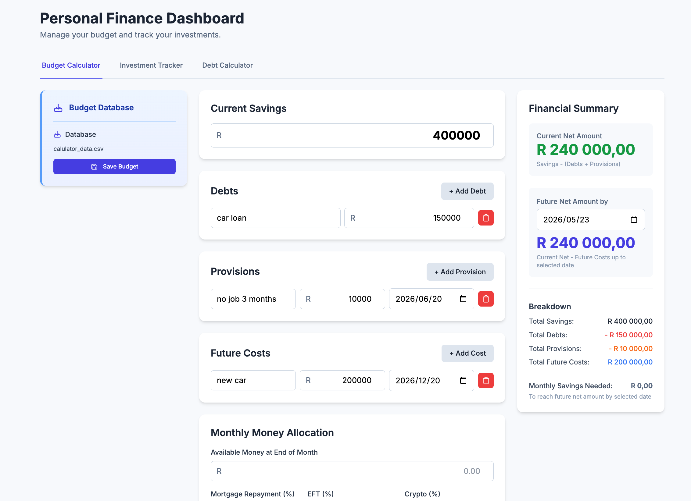

# Budget Calculator

A simple, local budget calculator application.



## How to run

1. **Setup Data**: First, copy the example data from `db/examples/` into the `db/` directory.
   ```bash
   cp -r db/examples/* db/
   ```
2. Open `budget_calculator.html` directly in your browser.
3. Alternatively, run `python3 -m http.server 8000` to serve the files.

## Styling

Styling uses a static Tailwind CSS build (no CDN). The committed stylesheet lives at `src/styles/tailwind.css`, with custom styles in `src/styles/app.css`. After changing any Tailwind class in `src/**` (HTML or JS), regenerate the stylesheet and commit it:

```bash
npm run build:css   # or: make css
```
